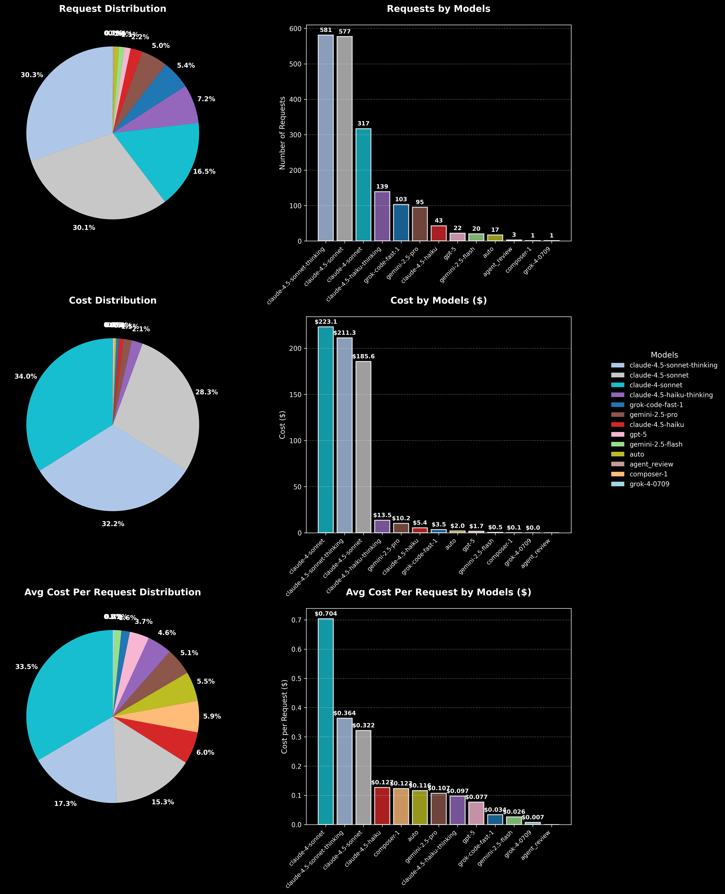
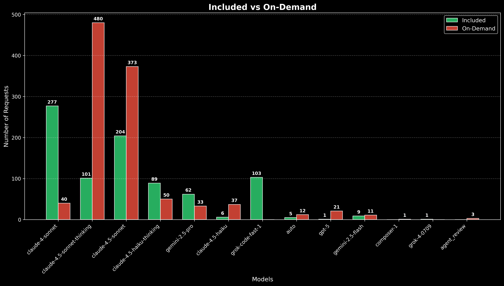
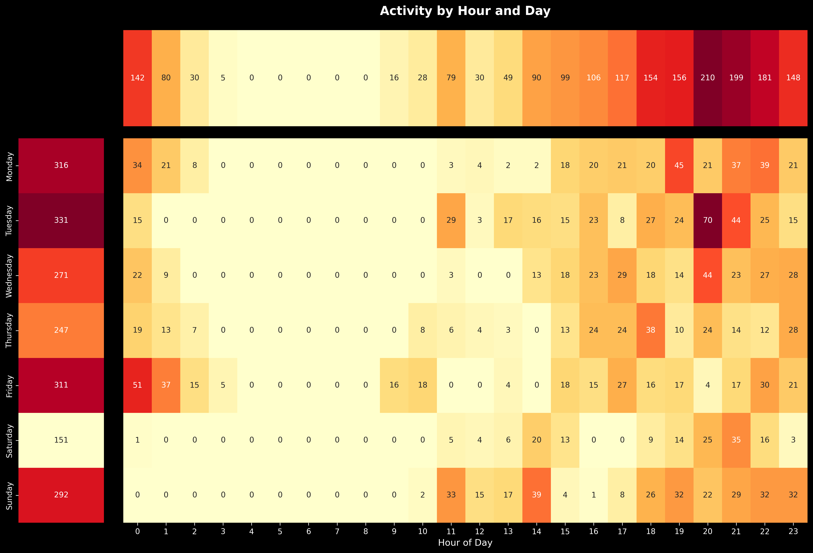
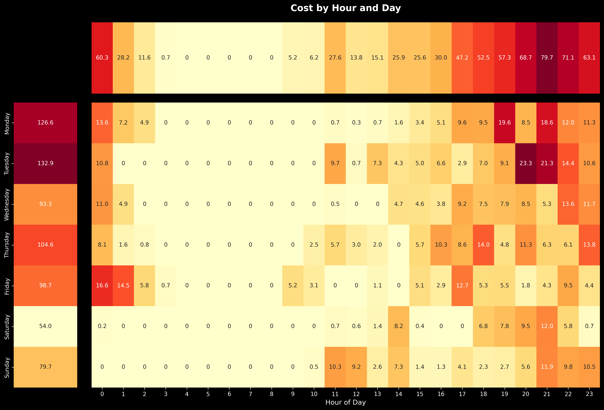
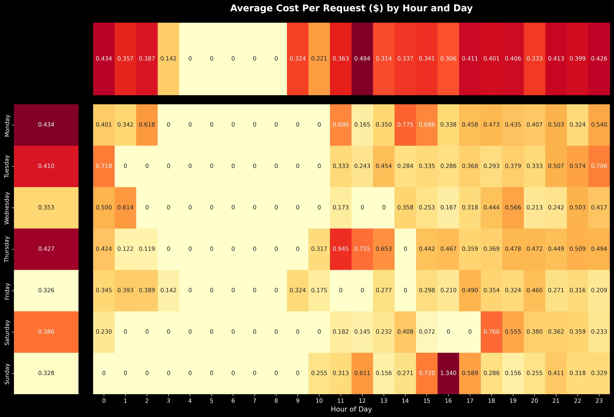

# 📊 Cursor Usage Analyzer

<div align="center">

**Powerful analytics tool for Cursor AI usage tracking and cost optimization**

[](LICENSE)

[English](#english) • [Русский](#русский)

</div>

---

## English

### 📖 About

Cursor Usage Analyzer is a comprehensive analytics tool for tracking and analyzing your Cursor AI usage. Export your usage data from Cursor, run the analyzer, and get detailed insights about your AI model consumption, costs, and usage patterns.

Perfect for:
- 💰 **Cost tracking** - understand where your money goes
- 📈 **Usage optimization** - identify peak hours and optimize workflows  
- 🔍 **Model comparison** - see which models you use most
- 📊 **Visual reports** - 9 beautiful charts and heatmaps

### ✨ Features

- **Comprehensive Analysis**
  - Detailed breakdown by AI models (Claude, GPT, Grok, etc.)
  - Token usage statistics (input, output, cache)
  - Cost calculation for Included and On-Demand requests
  - Temporal analysis (daily, hourly, weekly patterns)

- **Rich Visualizations**
  - 10 professional charts with dark theme
  - Interactive heatmaps showing usage patterns
  - Model comparison charts
  - Cost-per-request analytics and heatmaps
  - Box plot distribution analysis

- **Easy to Use**
  - Single command execution
  - Automatic CSV detection
  - Progress bars and detailed console output
  - Modular and extensible architecture

### 📸 Screenshots

#### Models Overview


#### Included vs On-Demand Comparison


#### Usage Heatmaps



#### Cost Per Request Heatmap


### 🚀 Quick Start

```bash
# Install dependencies
pip install matplotlib seaborn numpy tqdm

# Run analyzer
python main.py
```

That's it! The script will automatically find your CSV file and generate 10 charts in `graphics/` folder.

### 📊 Generated Reports

The analyzer creates 10 detailed visualizations:

| Chart | Description |
|-------|-------------|
| **Models Overview** | Pie chart + bar chart showing distribution of requests and costs |
| **Included vs On-Demand** | Comparison of included requests vs on-demand usage |
| **Token Statistics** | Detailed breakdown of input/output/cache tokens by model |
| **Cost Per Request** | Average cost analysis for each model |
| **Cost Distribution Box Plot** | Statistical distribution of costs (median, quartiles, outliers) |
| **Daily Activity** | Line chart of top 5 models activity over time |
| **Daily Activity (Split)** | Separate charts for each top model |
| **Requests Heatmap** | Hour × Weekday heatmap of request volume |
| **Cost Heatmap** | Hour × Weekday heatmap of spending |
| **Cost Per Request Heatmap** | Hour × Weekday heatmap of average cost per paid request |

### 🏗️ Project Structure

```
cursor-usage-analyzer/
├── main.py                    # Main entry point
├── analyzers/                 # Data analysis modules
│   ├── csv_analyzer.py       # CSV parsing and data extraction
│   └── cost_calculator.py    # Cost calculations
├── visualizers/               # Chart generation
│   ├── base_visualizer.py    # Base visualization class
│   ├── model_charts.py       # Model-related charts
│   ├── activity_charts.py    # Activity timeline charts
│   └── heatmap_charts.py     # Heatmap visualizations
├── utils/                     # Utility functions
├── csv_data/                  # Place your CSV files here
└── graphics/                  # Generated charts output
```


### 🤝 Contributing

Contributions are welcome! Feel free to open issues or submit pull requests.

### 📄 License

This project is licensed under the MIT License - see the [LICENSE](LICENSE) file for details.

### ⭐ Show Your Support

If this project helped you, please consider:
- ⭐ Starring the repository
- 🐛 Reporting bugs or suggesting features
- 📢 Sharing with other Cursor AI users

---

## Русский

### 📖 О проекте

Cursor Usage Analyzer - мощный инструмент аналитики для отслеживания и анализа использования Cursor AI. Экспортируйте данные из Cursor, запустите анализатор и получите детальную информацию о потреблении AI моделей, затратах и паттернах использования.

Идеально подходит для:
- 💰 **Отслеживания расходов** - понимайте куда уходят деньги
- 📈 **Оптимизации использования** - выявляйте пиковые часы и оптимизируйте рабочие процессы
- 🔍 **Сравнения моделей** - смотрите какие модели используете чаще всего
- 📊 **Визуальных отчетов** - 9 красивых графиков и тепловых карт

### ✨ Возможности

- **Комплексный анализ**
  - Детальная разбивка по AI моделям (Claude, GPT, Grok и др.)
  - Статистика использования токенов (input, output, cache)
  - Расчет стоимости для Included и On-Demand запросов
  - Временной анализ (дневные, почасовые, недельные паттерны)

- **Богатая визуализация**
  - 9 профессиональных графиков с темной темой
  - Интерактивные тепловые карты паттернов использования
  - Графики сравнения моделей
  - Аналитика стоимости на запрос и тепловые карты

- **Простота использования**
  - Запуск одной командой
  - Автоматическое определение CSV
  - Прогресс-бары и детальный вывод в консоль
  - Модульная и расширяемая архитектура

### 📸 Примеры графиков

#### Обзор моделей


#### Сравнение Included vs On-Demand


#### Тепловые карты использования


#### Тепловая карта стоимости запроса


### 🚀 Быстрый старт

```bash
# Установите зависимости
pip install matplotlib seaborn numpy tqdm

# Запустите анализатор
python main.py
```

Готово! Скрипт автоматически найдет ваш CSV файл и создаст 10 графиков в папке `graphics/`.

### 📊 Генерируемые отчеты

Анализатор создает 10 детальных визуализаций:

| График | Описание |
|--------|----------|
| **Обзор моделей** | Круговая + столбчатая диаграммы распределения запросов и затрат |
| **Included vs On-Demand** | Сравнение включенных запросов и использования по требованию |
| **Статистика токенов** | Детальная разбивка input/output/cache токенов по моделям |
| **Стоимость на запрос** | Анализ средней стоимости для каждой модели |
| **Box Plot распределения** | Статистическое распределение затрат (медиана, квартили, выбросы) |
| **Дневная активность** | График активности топ-5 моделей во времени |
| **Дневная активность (разделенная)** | Отдельные графики для каждой топ модели |
| **Тепловая карта запросов** | Час × День недели карта объема запросов |
| **Тепловая карта затрат** | Час × День недели карта расходов |
| **Тепловая карта стоимости запроса** | Час × День недели карта средней стоимости платного запроса |

### 🤝 Вклад в проект

Вклады приветствуются! Открывайте issues и pull requests.

### 📄 Лицензия

Проект распространяется под лицензией MIT - см. файл [LICENSE](LICENSE) для деталей.

---

<div align="center">

**Made with ❤️ for Cursor AI community**

[⬆ Back to top](#-cursor-usage-analyzer)

</div>

